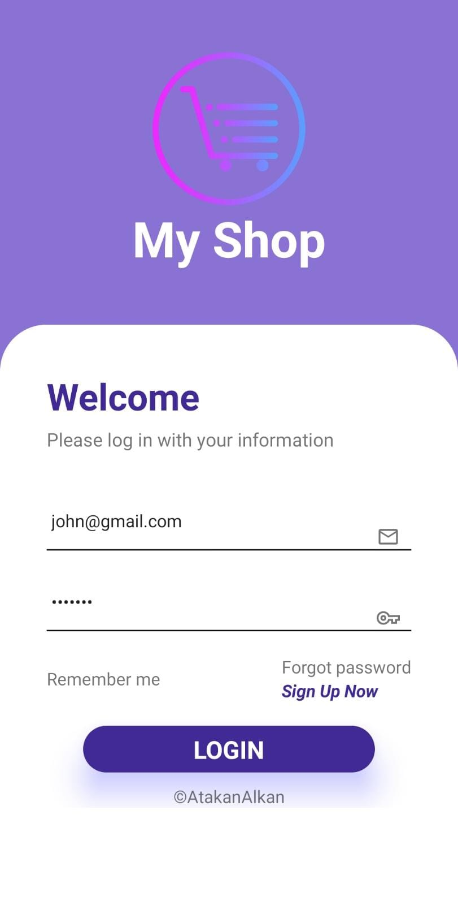
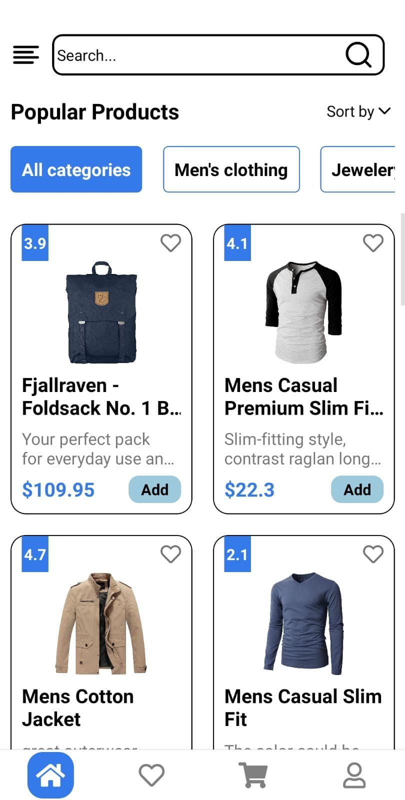
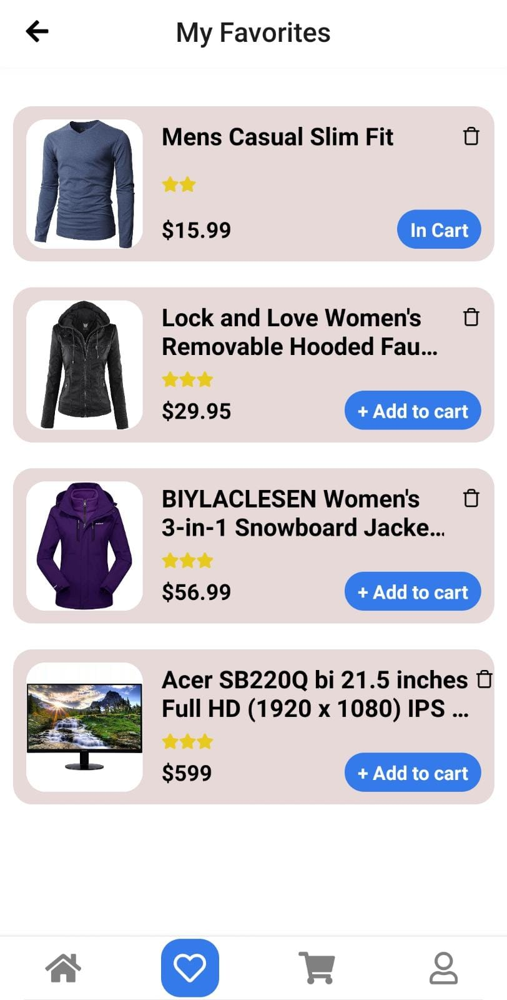
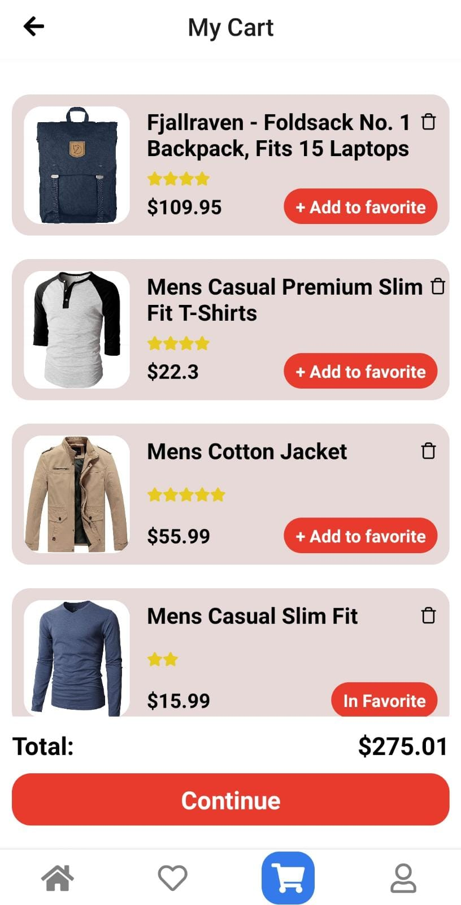
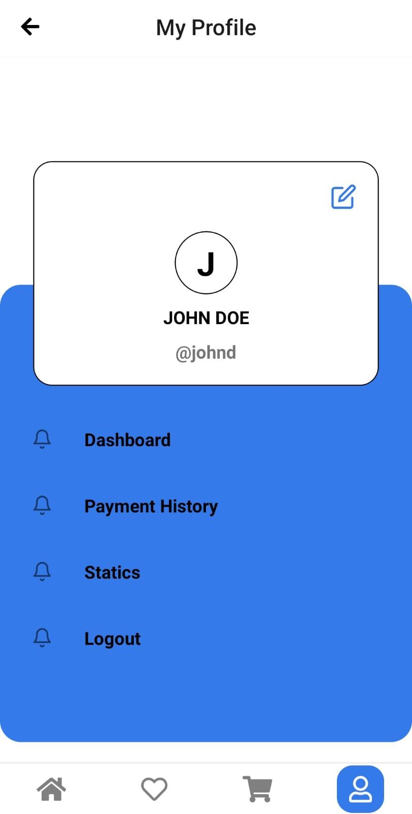

# MyShop Project

## Default Login Credentials

To access the application, you can use the following default login credentials:

- **Email:** john@gmail.com
- **Password:** m38rmF$

## Overview

Welcome to **MyShop App**, a React Native application designed to enhance your shopping experience. MyShop allows users to add products to favorites, manage shopping cart, sort products, and perform searches with ease. The app utilizes Redux for state management, providing a seamless user experience.

## Project Preview

<div style="display: flex; flex-direction: column; align-items: center;">
  <div style="margin-bottom: 20px;">
    
    <p style="font-weight: bold;">Login Screen</p>
  </div>
  
  <div style="margin-bottom: 20px;">
    
    <p style="font-weight: bold;">Home Screen</p>
  </div>
  
  <div style="margin-bottom: 20px;">
    
    <p style="font-weight: bold;">Favorites Screen</p>
  </div>
  
  <div style="margin-bottom: 20px;">
    
    <p style="font-weight: bold;">Cart Screen</p>
  </div>
  
  <div style="margin-bottom: 20px;">
    
    <p style="font-weight: bold;">Profile Screen</p>
  </div>
</div>

## Features

- Add products to favorites for quick access.
- Manage shopping cart with ease, including adding and removing items.
- Sort products based on different criteria for better browsing.
- Perform searches to quickly find desired products.
- Utilizes Redux for efficient state management.

## Technologies Used

This project is built using the following technologies and packages:

- React Native: A JavaScript framework for building native mobile apps.
- Redux: A predictable state container for managing global application state.
- React Navigation: A popular navigation library for React Native apps.
- AsyncStorage: Provides simple, asynchronous, key-value storage.

## Getting Started

To run this project locally, follow these steps:

1. **Clone the repository:**

   ```bash
   git clone https://github.com/AtakanAlkn/MyShop-ReactNative.git


   ```

2. **Navigate to the project directory:**

   cd MyShop-ReactNative

3. **Install dependencies:**

   npm install
   or
   yarn install

4. **Start the development server:**

   npm start
   or
   yarn start

5. **Run on iOS or Android:**

   To run the app on iOS or Android simulators/emulators, use the following commands respectively:

   npm run ios
   npm run android
   or
   yarn ios
   yarn android

**Congratulations!**
You've successfully set up and started the project locally. Feel free to explore the code, make changes, and test new features.

**Troubleshooting**
If you encounter any issues during the setup process or while running the app, consider the following steps:

Double-check that you've correctly configured your environment variables in the .env file.
Ensure you have Node.js and npm (or yarn) installed on your system.
Make sure you have Xcode (for iOS development) or Android Studio (for Android development) properly set up.
Clear the npm or yarn cache and node_modules directory, then run the installation step again.
If the problem persists, please open an issue on our GitHub repository. We'll be glad to assist you!

## License

This repository is licensed under the [MIT License](LICENSE).

## Contact

If you have any questions, suggestions, or just want to connect, you can reach me at:

- Email: alkan.atakan@outlook.com
- LinkedIn: [Atakan Alkan](https://www.linkedin.com/in/atakanalkn/)
